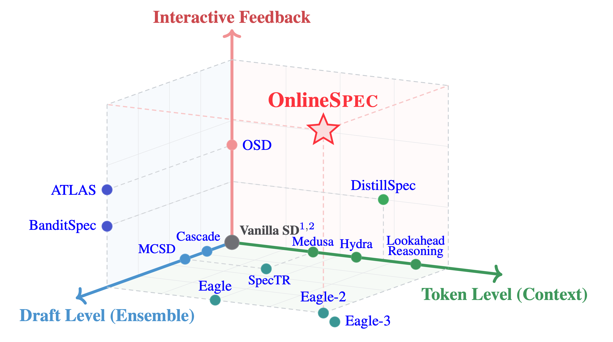

# 🌟 OnlineSpec: Speculative Decoding Meets Online Learning 🌟

<div align="center">

[](https://arxiv.org/abs/2603.12617)

</div>

## 📖 What is OnlineSpec?

<div align="center">



A 3D-visualization of our *OnlineSPEC* framework

</div>

**OnlineSpec** is a unified framework that integrates speculative decoding with online learning to achieve enhanced performance in large language model inference and adaptation.

This repository contains implementations of three key approaches:
- **Ens-EAGLE/Ens-EAGLE-3**: Online ensemble methods for EAGLE and EAGLE-3
- **Opt-Hydra**: Online learning with optimism for Hydra
- **Online-LR**: Online DPO for Lookahead Reasoning

## 📑 Table of Contents

- [Repository Structure](#repository-structure-guide)
- [Proposed Methods](#-proposed-methods)
  - [Ens-EAGLE/Ens-EAGLE-3](#-ens-eagleens-eagle-3)
  - [Opt-Hydra](#-opt-hydra)
  - [Online-LR](#-online-lr)
- [Reproduce the Results](#reproduce-the-results)

## Repository Structure Guide

This repository is organized as a multi-project workspace with shared common modules.

- `EAGLE/`: EAGLE, EAGLE-3, and OSD methods
- `Hydra/`: Hydra online learning framework
- `LR/`: Lookahead Reasoning
- `ospec_common/`: shared modules used by multiple projects

## 📝 Proposed Methods

This section introduces the key methodological contributions of OnlineSpec, which enhance the performance of speculative decoding through online learning techniques.

### 🎯 Ens-EAGLE/Ens-EAGLE-3

**Overview**: Online ensemble combines multiple draft models with different learning rates to improve speculative decoding performance. This method leverages ensemble learning principles to achieve better accuracy than single-model approaches.

**Key Benefits**:
- Outperforms offline and simple online update methods
- Robust performance through model diversity
- Effective for both EAGLE and EAGLE-3 frameworks

**Usage Example**:

**EAGLE**:
```bash
python pipeline_hedge.py \
  --data-file data/gsm_online_4k.jsonl \
  --base-model-path ~/PTM/vicuna-7b-v1.3 \
  --ea-model-path-1 ckpts/vicuna/gsm \
  --ea-model-path-2 ckpts/vicuna/gsm \
  --ea-model-path-3 ckpts/vicuna/gsm \
  --chunk-size 40 \
  --chunk-dir tmp/chunk \
  --output-ea-dir fined_model_3lr \
  --lr-1 5e-4 \
  --lr-2 1e-3 \
  --lr-3 1e-1 \
  --num-epochs 1 \
  --log-file vicuna_gsm_chunk40_lr5e-4_1e-3_1e-1_epoch1
```

**EAGLE-3**:
```bash
python pipeline_eagle3_hedge.py \
  --data-file data/gsm_online_4k.jsonl \
  --base-model-path ~/PTM/Llama-2-7b-chat-hf \
  --ea-model-path-1 ./eagle3_ckpts/llama/gsm \
  --ea-model-path-2 ./eagle3_ckpts/llama/gsm \
  --ea-model-path-3 ./eagle3_ckpts/llama/gsm \
  --chunk-size 40 \
  --batch-size 2 \
  --lr-1 2e-4 \
  --lr-2 1e-4 \
  --lr-3 4e-4 \
  --num-epochs-1 2 \
  --num-epochs-2 2 \
  --num-epochs-3 2 \
  --log-file llama_gsm8k_hedge_lr2e-4_1e-4_4e-4_epoch2
```

### 🚀 Opt-Hydra

**Overview**: Online learning with optimism (momentum-based updates) enhances the Hydra head model's adaptation to streaming data. This approach maintains an optimistic update direction based on historical gradients, leading to faster convergence and better performance.

**Key Benefits**:
- Superior performance compared to offline and simple online update methods
- Faster adaptation to new data patterns
- Stable training dynamics through momentum

**Usage Example**:

```bash
python pipeline.py \
  --data-file data/gsm_4k.jsonl \
  --hydra-model-path ckpts/vicuna/gsm \
  --chunk-size 80 \
  --chunk-dir tmp/data_chunks \
  --output-model-dir tmp/outputs \
  --lr 1e-1 \
  --num-epochs 3 \
  --with-momentum \
  --log-file vicuna_gsm_opt
```

### 🧠 Online-LR

**Overview**: Online Direct Preference Optimization (DPO) fine-tunes the draft model in Lookahead Reasoning, enabling better alignment with target model preferences. This method improves upon offline and simple online supervised fine-tuning (SFT) approaches.

**Key Benefits**:
- Better alignment with target model preferences
- Improved reasoning accuracy through preference learning
- More effective than standard SFT methods

**Usage Example**:

```bash
python pipeline.py \
  --dataset data/math.jsonl \
  --draft_model_path ./Qwen3-0.6B-Base \
  --target_model Qwen/Qwen3-8B \
  --method dpo
```

## Reproduce the Results

### 📥 Model Preparation

```bash
# Download Vicuna-7B-v1.3 (for EAGLE, EAGLE-3 and Hydra)
huggingface-cli download lmsys/vicuna-7b-v1.3 --local-dir ~/PTM/vicuna-7b-v1.3 --local-dir-use-symlinks False

# Download Llama-2-7B-Chat-HF (for EAGLE, EAGLE-3 and Hydra)
huggingface-cli download meta-llama/Llama-2-7b-chat-hf --local-dir ~/PTM/Llama-2-7b-chat-hf --local-dir-use-symlinks False

# Download Qwen3-0.6B-Base (for LR)
huggingface-cli download Qwen/Qwen3-0.6B-Base --local-dir ./LR/Qwen3-0.6B-Base --local-dir-use-symlinks False
```

### 📊 Data Preparation

```bash
# for EAGLE and EAGLE-3
cd EAGLE/data/
python prepare_data.py

# for Hydra
cd ../../Hydra/data/
pip install 'datasets<3.0.0'
python prepare_data.py

# for Lookahead Reasoning
cd ../../LR/data/
python prepare_data.py
```

### 🦅 EAGLE, EAGLE-3

#### 🔧 Environment Setup

```bash
conda create -n eagle python=3.12 -y
conda activate eagle
cd EAGLE
pip install -r requirements.txt
```

#### EAGLE

```bash
# Warmup training
cd EAGLE/script/EAGLE/
bash eagle-train.sh

# Offline Evaluation
bash eagle-offline.sh

# Online Evaluation and Update
bash eagle-online.sh

# Online Ensemble
bash eagle-ens.sh
```

#### EAGLE-3

```bash
# Warmup training
cd EAGLE/script/EAGLE-3/
bash eagle-train.sh

# Offline Evaluation
bash eagle-offline.sh

# Online Evaluation and Update
bash eagle-online.sh

# Online Ensemble
bash eagle-ens.sh
```

### 🐉 Hydra

#### 🔧 Environment Setup

```bash
conda create -n hydra python=3.10 -y
conda activate hydra
cd Hydra
pip install -e ".[train]"
```

#### 🚀 Running Experiments

```bash
# Offline Training Warmup
cd Hydra/script/
bash train.sh

# Online Evaluation and Update
bash run.sh
```

### 🧠 Lookahead Reasoning (LR)

#### 🔧 Environment Setup

```bash
conda create -n lar python=3.10 -y
conda activate lar
cd LR
pip install -r requirements.txt
```

#### 🚀 Running Experiments

```bash
cd LR/script/
bash reproduce.sh

# Test Accuracy
cd LR/test_accuracy/
# Run the corresponding Python scripts for each dataset
python test_<dataset>.py
```

## 🙏 Acknowledgments

This project builds upon excellent open-source work:
- [EAGLE](https://github.com/SafeAILab/EAGLE)
- [Hydra](https://github.com/zankner/Hydra)
- [Lookahead Reasoning](https://github.com/hao-ai-lab/LookaheadReasoning)
- [Spec-Bench](https://github.com/hemingkx/Spec-Bench)

## 📝 Citation

If you find our work useful for your research, please star our project and cite our work.

```bibtex
@article{arxiv'26:onspec,
  title   = {When Drafts Evolve: Speculative Decoding Meets Online Learning},
  author  = {Yu-Yang Qian and Hao-Cong Wu and Yichao Fu and Hao Zhang and Peng Zhao},
  journal = {ArXiv preprint},
  volume  = {arXiv:2603.12617},
  year    = {2026}
}
```

<div align="center">

⭐ Star us on GitHub and cite our paper if you find this project helpful!

</div>